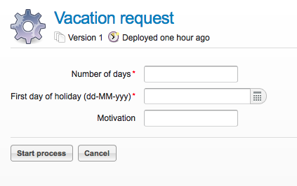

# 快速使用activiti

## springboot集成activiti

pom.xml:

    <?xml version="1.0" encoding="UTF-8"?>
    <project xmlns="http://maven.apache.org/POM/4.0.0" xmlns:xsi="http://www.w3.org/2001/XMLSchema-instance"
        xsi:schemaLocation="http://maven.apache.org/POM/4.0.0 http://maven.apache.org/xsd/maven-4.0.0.xsd">
        <modelVersion>4.0.0</modelVersion>

        <groupId>com.example</groupId>
        <artifactId>activiti-demo-mybatis</artifactId>
        <version>0.0.1-SNAPSHOT</version>
        <packaging>jar</packaging>

        <name>springboot-activiti-mybatis</name>
        <description>Demo project for Spring Boot</description>

        <parent>
            <groupId>org.springframework.boot</groupId>
            <artifactId>spring-boot-starter-parent</artifactId>
            <version>1.5.6.RELEASE</version>
            <relativePath/> <!-- lookup parent from repository -->
        </parent>

        <properties>
            <project.build.sourceEncoding>UTF-8</project.build.sourceEncoding>
            <project.reporting.outputEncoding>UTF-8</project.reporting.outputEncoding>
            <java.version>1.8</java.version>
            <activiti.version>6.0.0</activiti.version>
            <oracle.version>11.2.0.3</oracle.version>
            <!--<oracle.version>11.2.0.4.0-atlassian-hosted</oracle.version>-->
        </properties>

        <dependencies>
            <dependency>
                <groupId>org.springframework.boot</groupId>
                <artifactId>spring-boot-starter-aop</artifactId>
            </dependency>
            <dependency>
                <groupId>org.springframework.boot</groupId>
                <artifactId>spring-boot-starter-web</artifactId>
            </dependency>

            <dependency>
                <groupId>org.mybatis.spring.boot</groupId>
                <artifactId>mybatis-spring-boot-starter</artifactId>
                <version>1.3.0</version>
            </dependency>

            <dependency>
                <groupId>org.activiti</groupId>
                <artifactId>activiti-spring-boot-starter-basic</artifactId>
                <version>${activiti.version}</version>
            </dependency>

            <dependency>
                <groupId>org.activiti</groupId>
                <!--<artifactId>spring-boot-starter-rest-api</artifactId>-->
                <artifactId>activiti-spring-boot-starter-rest-api</artifactId>
                <version>${activiti.version}</version>
            </dependency>

            <dependency>
                <groupId>org.activiti</groupId>
                <artifactId>activiti-spring-boot-starter-actuator</artifactId>
                <version>${activiti.version}</version>
            </dependency>

            <dependency>
                <groupId>com.h2database</groupId>
                <artifactId>h2</artifactId>
                <scope>runtime</scope>
            </dependency>

            <!-- Use Oracle -->
            <dependency>
                <groupId>com.oracle</groupId>
                <artifactId>ojdbc6</artifactId>
                <version>${oracle.version}</version>
            </dependency>

            <dependency>
                <groupId>org.projectlombok</groupId>
                <artifactId>lombok</artifactId>
                <optional>true</optional>
            </dependency>

            <dependency>
                <groupId>com.alibaba</groupId>
                <artifactId>fastjson</artifactId>
                <version>1.2.30</version>
            </dependency>

            <dependency>
                <groupId>commons-beanutils</groupId>
                <artifactId>commons-beanutils</artifactId>
                <version>1.9.2</version>
            </dependency>

            <dependency>
                <groupId>org.slf4j</groupId>
                <artifactId>slf4j-api</artifactId>
                <version>1.7.21</version>
            </dependency>
            <dependency>
                <groupId>org.slf4j</groupId>
                <artifactId>slf4j-log4j12</artifactId>
                <version>1.7.21</version>
            </dependency>

            <dependency>
                <groupId>org.springframework.boot</groupId>
                <artifactId>spring-boot-starter-test</artifactId>
                <scope>test</scope>
            </dependency>

        </dependencies>

        <build>
            <plugins>
                <plugin>
                    <groupId>org.springframework.boot</groupId>
                    <artifactId>spring-boot-maven-plugin</artifactId>
                </plugin>
            </plugins>
        </build>
    </project>

**配置数据源**

application.properties:

    spring.datasource.driverClassName = com.mysql.jdbc.Driver
    spring.datasource.url = jdbc:mysql://localhost:3306/activiti2?useUnicode=true&characterEncoding=utf-8
    spring.datasource.username = root
    spring.datasource.password = 123456

    spring.jpa.hibernate.ddl-auto=update

activiti遵循springboot的配置。

## 八大接口使用

### ProcessEngine 

可以通过如下获取：

    ProcessEngine processEngine = ProcessEngines.getDefaultProcessEngine();

如果集成了spring则可以直接通过自动注入：

    @Autowired
    private ProcessEngine processEngine;

获取工作流引擎对象。
引擎对象可以获取八大服务接口：

    RuntimeService runtimeService = processEngine.getRuntimeService();
    RepositoryService repositoryService = processEngine.getRepositoryService();
    TaskService taskService = processEngine.getTaskService();
    ManagementService managementService = processEngine.getManagementService();
    IdentityService identityService = processEngine.getIdentityService();
    HistoryService historyService = processEngine.getHistoryService();
    FormService formService = processEngine.getFormService();
    DynamicBpmnService dynamicBpmnService = processEngine.getDynamicBpmnService();

`ProcessEngines.getDefaultProcessEngine()`

在第一次被调用时将初始化并构建流程引擎，在之后的调用都会返回相同的流程引擎。流程引擎的创建通过ProcessEngines.init()实现，关闭由ProcessEngines.destroy()实现。

ProcessEngines会扫描所有activiti.cfg.xml与activiti-context.xml文件。对于所有的activiti.cfg.xml文件，流程引擎会以标准Activiti方式构建：ProcessEngineConfiguration.createProcessEngineConfigurationFromInputStream(inputStream).buildProcessEngine()。对于所有的activiti-context.xml文件，流程引擎会以Spring的方式构建：首先构建Spring应用上下文，然后从该上下文中获取流程引擎。

### RuntimeService

* 启动流程定义的新流程实例
* 查询各种流程实例状态

常用接口：
    
    ProcessInstance startProcessInstanceByKey(String var1, String var2);
    ProcessInstance startProcessInstanceByKey(String var1, Map<String, Object> var2);
    ProcessInstance startProcessInstanceByKeyAndTenantId(String var1, String var2);
    ProcessInstance startProcessInstanceByKeyAndTenantId(String var1, Map<String, Object> var2, String var3);
    
### repositoryService

* 提供了管理与控制deployments（部署）与process definitions（流程定义）的操作
* RepositoryService提供的是静态信息（也就是不会改变，至少不会经常改变的信息）
* 查询引擎已知的部署与流程定义。
* 暂停或激活部署中的某些流程，或整个部署。暂停意味着不能再对它进行操作，激活是其反操作。
* 读取各种资源，比如部署中保存的文件，或者引擎自动生成的流程图。
* 读取POJO版本的流程定义。使用它可以用Java而不是xml的方式检查流程。(用处不大)

eg:

    ProcessEngine processEngine = ProcessEngines.getDefaultProcessEngine();
            RepositoryService repositoryService = processEngine.getRepositoryService();
            repositoryService.createDeployment()
                    .addClasspathResource("processes/one-task-process.bpmn20.xml")
                    .deploy();

### taskService

对于BPM引擎来说，核心是需要人类用户实际操作的任务。所有任务相关的东西都组织在TaskService中；

* 查询分派给用户或组的任务
* 创建standalone（独立运行）任务。这是一种没有关联到流程实例的任务。

创建流程引擎时，会在classpath下搜索activiti.cfg.xml配置文件，并基于此文件进行构建。
如果没找到，则会基于默认的配置创建引擎。
如果已经创建了默认引擎，但是又不想用这个引擎，想换个，那就可以通过这种方式。

决定任务的执行用户（assignee），或者将用户通过某种方式与任务关联。
认领（claim）与完成（complete）任务。认领是指某人决定成为任务的执行用户，也即他将会完成这个任务。完成任务是指“做这个任务要求的工作”，通常是填写某种表单。

### managementService

ManagementService通常在用Activiti编写用户应用时不需要使用。它可以用于读取数据库表与表原始数据的信息，也提供了对作业（job）的查询与管理操作。Activiti中很多地方都使用作业，例如定时器（timer），异步操作（asynchronous continuation），延时暂停/激活（delayed suspension/activation）等等。

一般在应用于一些复杂的场景

### identityService

    Group group = identityService.newGroup("user");
    group.setName("users");
    group.setType("security-role");
    identityService.saveGroup(group);

    User admin = identityService.newUser("admin");
    admin.setPassword("admin");
    identityService.saveUser(admin);
    
它用于管理（创建，更新，删除，查询……）组与用户。对应的数据库表是`ACT_ID_*`所有数据库;

activiti执行时不会对用户执行检查。任务可以分配给任何人，无论这个用户是否存在。

可以与spring-rest配合对接口进行鉴权。

### formService

Form Service 表单服务。可选的。提供启动表单和任务表单两个概念。即在流程实例启动前展示给用户的，和完成任务时展示给用户的两种表单。注意，这是个可选服务，表单不一定需要嵌入到流程定义中。

请假流程例子，eg:

    <startEvent>
      <extensionElements>
        <activiti:formProperty id="numberOfDays" name="天数" value="${numberOfDays}" type="long" required="true"/>
        <activiti:formProperty id="startDate" name="开始时间" value="${startDate}" datePattern="dd-MM-yyyy hh:mm" type="date" required="true" />
        <activiti:formProperty id="vacationMotivation" name="理由" value="${vacationMotivation}" type="string" />
      </extensionElements>
    </userTask>

部署完了后，用activiti-app打开的效果是这样的：

**支持下列表单参数类型：**

* string (org.activiti.engine.impl.form.StringFormType
* long (org.activiti.engine.impl.form.LongFormType)
* enum (org.activiti.engine.impl.form.EnumFormType)
* date (org.activiti.engine.impl.form.DateFormType)
* boolean (org.activiti.engine.impl.form.BooleanFormType)

### dynamicBpmnService

DynamicBpmnService可以用于更改流程定义的一部分，而不需要重新部署它。例如，您可以在流程定义中更改一个用户任务的按收人定义，或者更改服务任务的名称。

常用接口：

    void saveProcessDefinitionInfo(String var1, ObjectNode var2);

    ObjectNode changeServiceTaskClassName(String var1, String var2);

    void changeServiceTaskClassName(String var1, String var2, ObjectNode var3);

    ObjectNode changeServiceTaskExpression(String var1, String var2);

    void changeServiceTaskExpression(String var1, String var2, ObjectNode var3);

    ObjectNode changeUserTaskName(String var1, String var2);
    
    void changeUserTaskName(String var1, String var2, ObjectNode var3);
    
    ObjectNode changeUserTaskDescription(String var1, String var2);

### HistoryService

`HistoryService`暴露所有Activiti引擎收集的历史数据。当执行流程时，引擎会保存许多数据（可以配置），例如流程实例启动时间，谁在执行哪个任务，完成任务花费的事件，每个流程实例的执行路径，等等。

## 事务与并发处理

如果触发了 Activiti 的操作（比如，开始流程，完成任务，触发流程继续执行）， Activiti 会推进流程，直到每个分支都进入等待状态。更抽象的说，它会流程图执行深度优先搜索， 如果每个分支都遇到等待状态，就会返回。等待状态是"稍后"需要执行任务， 就是说 Activiti 会把当前状态保存到数据库中，然后等待下一次触发。 触发可能来自外部，比如用户任务或接收到一个消息，也可能来自 Activiti 本身，比如我们设置了定时器事件。

**事务**

* 如果在complete下一个任务时出错,则流程回滚到上一个任务，当前任务为等待状态
* activiti事务可与业务系统事务进行统一(数据源相同的情况下是统一的，不可数据源则需要特殊配置)

**并发处理**
activiti的任务执行可以后台线程异步job执行的(job执行器周期的对数据库job进行扫描)，如果没有设置job的过期时间，默认是5分钟。
针对大数据量的并发时，采用job执行器的方式可以保证所有的流程实例的job不会并发执行，都是顺序执行。

从 Activiti 5.9开始，JobExecutor 能保证同一个流程实例中的 job 不会并发执行。
为什么不会有并发问题？

https://doc.yonyoucloud.com/doc/activiti-5.x-user-guide/Chapter%208.%20BPMN%202.0%20Constructs%20%E5%85%B3%E4%BA%8E%20BPMN%202.0%20%E6%9E%B6%E6%9E%84/Transactions%20and%20Concurrency%20%E4%BA%8B%E5%8A%A1%E4%B8%8E%E5%B9%B6%E5%8F%91.html

如下面的流程：

      <process id="JobTaskProcess" name="执行job的流程测试">
            <startEvent id="theStart" />
            <sequenceFlow id="flow1" sourceRef="theStart" targetRef="printTask" />
            <serviceTask id="printTask" name="print" activiti:async="true" activiti:class="com.example.demo.service.delegate.MyJavaDelegate"/>
            <sequenceFlow id="flow2" sourceRef="printTask" targetRef="theEnd" />
            <endEvent id="theEnd" />
        </process>
        
        
  MyJavaDelegate:
  
      public class MyJavaDelegate implements JavaDelegate {
          public void execute(DelegateExecution execution){
      //        String var = (String) execution.getVariable("input");
      //        var = var.toUpperCase();
      //        execution.setVariable("input", var);
      
              System.out.println("delegate execute run");
              System.out.println("打印。。。。。。。");
      
          }
      }